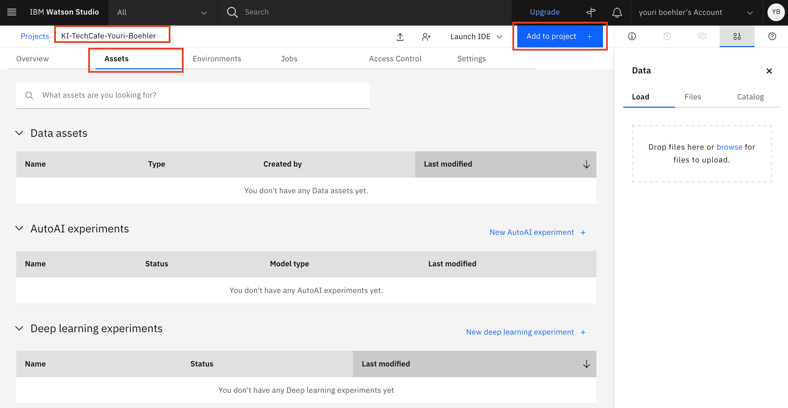
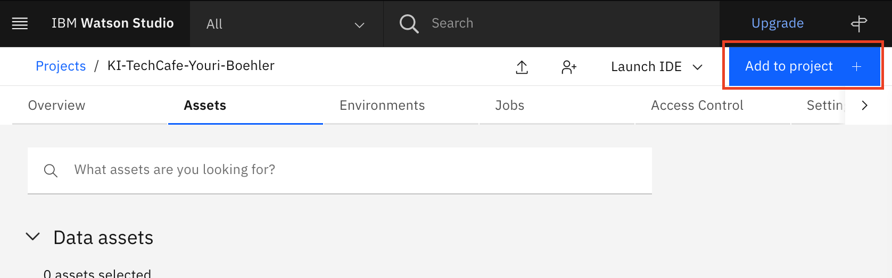
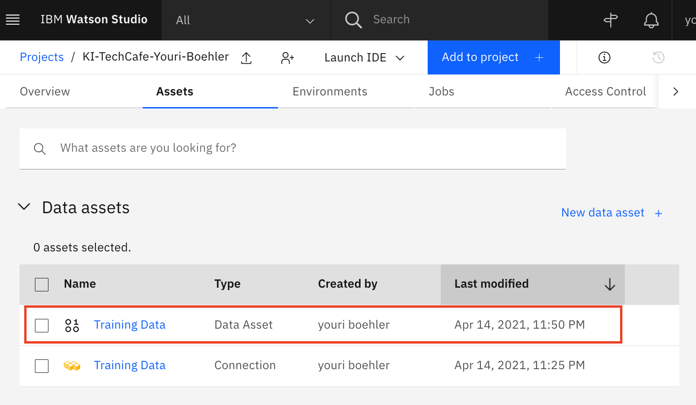
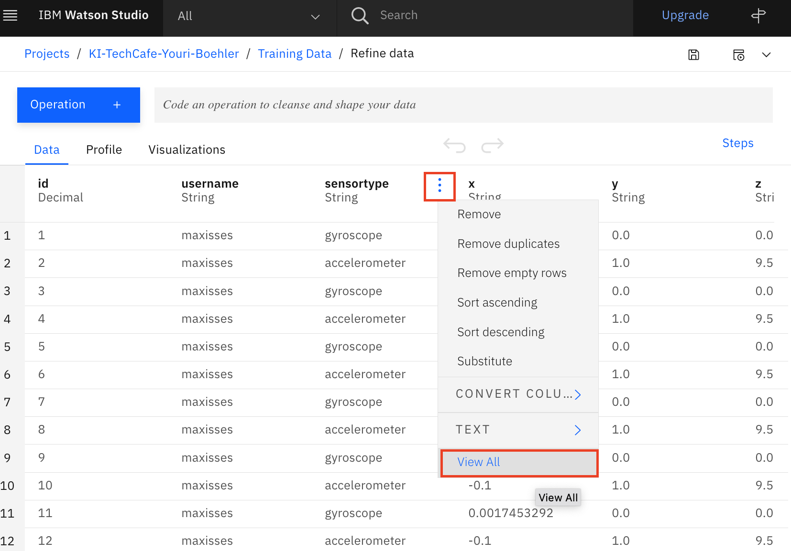

# Connect Data / Visuelle Datenbearbeitung zeigen

#### Beschreibung

Im nächsten Schritt werden wir die gesammelten Daten mit dem neu angelgten Projekt verknüpfen, Hierzu benötigen wir die Credntials der PotsgreSQL Datenbank. 

#### Schritt für Schritt Anleitung

1. In deinem Projekt navigiere in das Tab **«Assets»** und clicke **«Add to project»**



2.  Choose asset type **«Connection»**


3. Wähle die **«Databes for PostgreSQL»** aus


4. Füge die untenstehenden **Credentials** in die Verbindung ein**.** Das **Passwort** wird von den Kursleiter zur Verfügung gestellt.

```text
credentials_1 = {
    'username': 'ibm_cloud_f8726b6e_07e9_4ba4_8caa_a02519685fbd',
    'password': 'Ask your instructor for the Password',
    'database': 'ibmclouddb',
    'host': '4745c81c-3ddb-4109-ac69-54781cd84256.d7deeff0d58745aba57fa5c84685d5b4.databases.appdomain.cloud',
    'port': '32023',
}
```


5. Nach erfolgreichen verbinden solltest du jetzt eine neue **«Connection»** sehen


6. Click **«Add to project»**



7. Click **«Connected data»** und **«Select Source»**


8. In der Datenbank such nach der **«sensortraindata»** Datenbank und clicke **«Select»**


9. Gebe der Datenbank einen Namen: z.B. **Training Data** und clicke **«Create»**


10. Falls du alles richtig eingegeben hast, solltest du jetzt einen weiteren Eintrag bei den Data Assets sehen. Clicke auf deine Trainings Daten vom Typ **«Data Asset»**



Für unser Machine Learning Model wollen wir uns in einem ersten Schritt nur auf die Beschleunigungsensor konzentrieren, diese gilt es herauszufiltern.

11.  Click on **«Refine».** Bis die Daten geladen werden kann es ein paar Sekunden dauern.


12.  Danach 



13. Wähle die Option **«Filter»** und filtere nach dem Text **«accelerometer»** und clicke «**Apply»**


14. Nun erstelle deine erste Visualisierung. 

1. Füge eine **«Multi series»** Grafik hinzu
2. Wechsle ****auf das **«Visaulizations»** Tab
3. X-Axis: **ts**
4. Y-Axis**: x, y, z -&gt; Line**
5. Vergössere den Ausschnitt


Herzlichen Glückwunsch. Du hast deine erste Visualisierung erstellt


