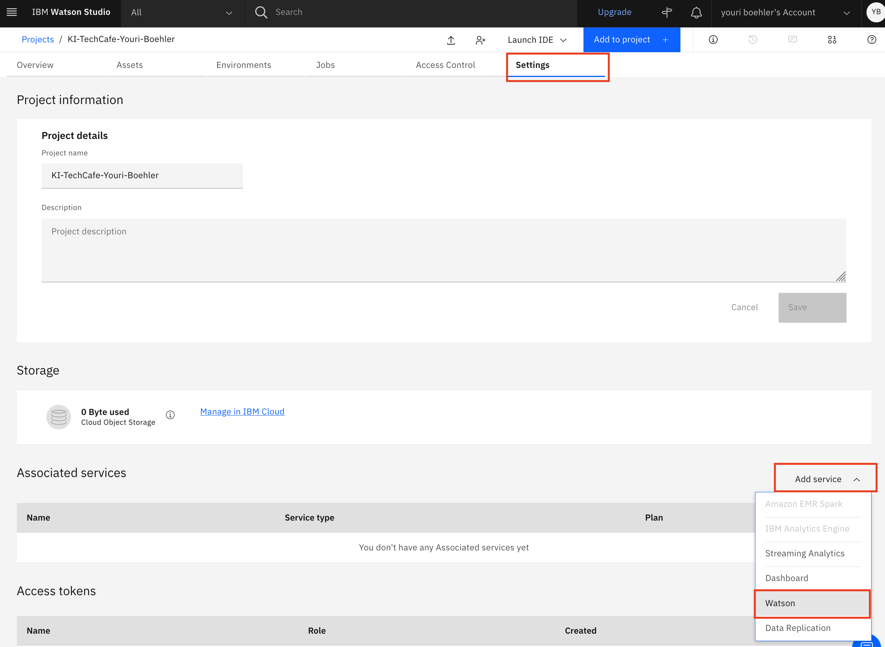
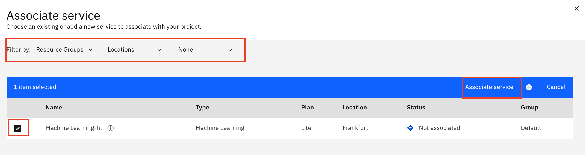

# Ü3.1 - Services aufsetzen & Projekt anlegen

#### Beschreibung

Um mit den Daten zu arbeiten müssen wir zuerst dir Umgebung richtig aufsetzten. Hierfür benutzen wir das CloudPak4Data as a Service \(CP4DaaS\), welches auf der IBM Public Cloud kostenlos zur verfügung steht. Zum Bearbeiten unseres Use Cases benötigen wir folgende 3 Services:  
- Watson Studio  
- Object Storage  
- Watson Machine Learning

#### Schritt für Schritt Anleitung

1.Login in die IBM Cloud: [https://cloud.ibm.com/login](https://cloud.ibm.com/login)

2. Im Suchfeld nach **"Watson Studio"** suchen und öffnen.

3. In «Create Tab» folgende **Einstellung für Watson Studio:**

1. Select a location: **Frankfurt \(eu-de\)**
2. Select a pricing plan: **Lite**
3. Service name: z.B. **Watson Studio + «Dein Name»** \(-&gt; Name spielt keine Rolle\)
4. Select a resource group: **Default** \(oder evt. eine andere\)
5. Click **«Create»** um den Service zu deployen

4. Im Suchfeld nach **"Obejct Storage"** suchen und öffnen.

5. In «Create Tab» folgende **Einstellung für Object Storage:**

1. Select: **Cloud Object Storage \(Lite\)**
2. Click **«Create»** um den Service zu deployen
3. Evt. nochmals mit **«Create»** den Lite Service bestätigen

6. Im Suchfeld nach **"Watson Machine Learning"** suchen und öffnen.

7. Im «Create Tab» folgende **Einstellung für Watson Machine Learning**

1. Select a location: **Frankfurt \(eu-de\)**
2. Select a pricing plan: **Lite**
3. Service name: z.B. **Watson Machine Learning + «Dein Name»** \(-&gt; Name spielt keine Rolle\)
4. Select a resource group: **Default** \(oder evt. eine andere\)
5. Click **«Create»** um den Service zu deployen

8. In die persönliche **«Resource List»** wechseln

9. Überpüfe ob alle **3 Services** angelegt worden sind \(Watson Studio, Object Storage, Watson Machine Learning\)

10. Klicke auf die **Watson Studio** Instanz und dann auf **Get Started**  um das Watson Studio / CP4DaaS zu öffnen

Well Done! Du hast jetzt eine Watson Studio Instanz aufgesetzt. In den nächsten Schritten legen wir ein Projekt an und verbinden die anderen Services mit dem Projekt

11. Klicke **«View all projects»** und wechsle zu deinen Porjekten

12. Click **«New Project»** und lege ein neues Projekt an \(Fall kein Projekt vorhanden ist, sieht das User Interface ein wenig anders aus.

13. **«Create Empty project»**

14. Konfiguriere dein Porjekt

1. Name: z.B. **«KI-TechCafe-**_**Vorname-Nachname**_**»**
2. Storage: hier sollte automatisch dein Object Storage erscheinen
3. Click **«Create»**

15. **«Watson Machine Learning»** Service hinzufügen \(Teil1/2\)

1. Wechsle auf das Tab **«Settings»**
2. **Add Services**
3. **Watson**

16. **«Watson Machine Learning»** Service hinzufügen \(Teil2/2\)

1. Alle Filter löschen \(Reource Group, Locations, None\)
2. Machine Learning Instanz markieren
3. **«Associate service»**

17. Well Done. Die Data Science Umgebung ist jetzt soweit aufgesetzt. Jetzt kann es losgehen.

